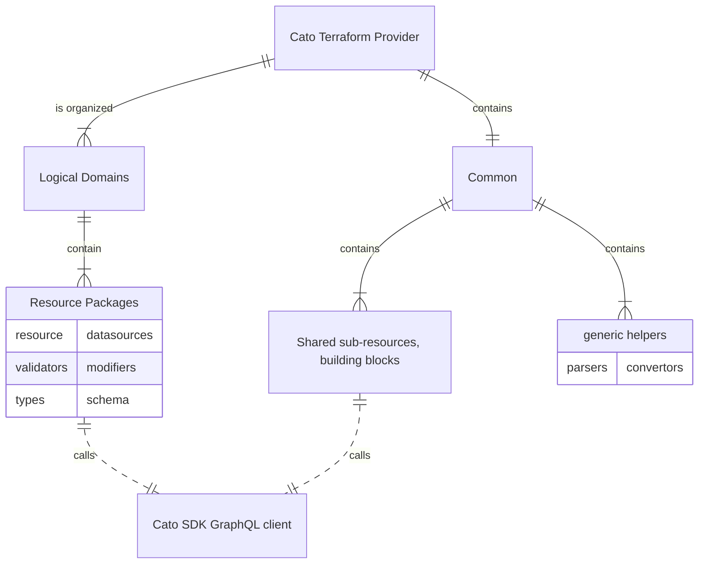
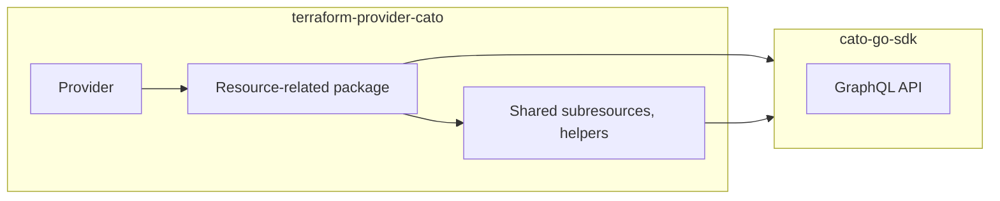

# Terraform Provider Structure Guidelines

## Purpose and scope

This document describes the logical structure of the provider, go package
organization and the dependency direction between those packages.

## High-level architecture

### Cato Terraform Provider
The provider code is located under `./internal/provider/` directory. It shall be organized in the following way:

- The `Cato Terraform Provider` code is organized into specific domains under `./internal/provider/{domain}` (e.g. `./internal/provider/network/`).
  Helpers and shared packages not belonging to a specific domain are located under the `./internal/provider/common/` directory.
- Each `domain` then contains resource related packages `./internal/provider/{domain}/{resource-package}` (e.g. `./internal/provider/network/netrange/`)
- Each `resource-related package` contains code for handling a specific resource, and optionally relevant data-sources.
  - it should be self contained, i.e. should include resource schema and terraform type definitions,
    config and CRUD methods, validators, plan modifiers (if needed).
    Unit tests should be kept alongside the resource code.
  - it may import "common" packages (shared building blocks, or generic helpers)
  - it must not import "provider" package nor other resource-related packages, in order to avoid import cycles.
- The packages under `./internal/provider/common/` directory contain:
  - `sub-resources` that may be shared by multiple resources (e.g. `dhcp`).
    Each sub-resource package can contain the same kind of code as the resource-related package.
  - `generic helpers` including:
    - `parsers` that convert API responses (go types defined in SDK) into terraform type system used for state or plan objects.
    - `preps` that prepre graphql requests - convert terraform type system objects (plan) into go types used by SDK API client.
    - `utils` helper utilities

#### Dependency direction
- `provider` registers resource or datasource handlers in `resource-related package`
- `resource-related package` may utilize helpers or sub-resource definitions under `common/` 
- `resource-related package` uses `cato-go-sdk` to make API calls
 

---

#### Acceptance Tests
The Acceptance tests are integration tests that call the real APIs, based on the terraform test script definitions.
Each resource should have its acceptance test in `./internal/acctests/{resource}`, (e.g. `./internal/acctests/app_connector/app_connector_test.go`)

It is possible to configure the acceptance tests to call a mock API server instead of the real one.
The mock code is in `./internal/accmock/`, test data is in `./test_data/`

#### Documentation, Examples
Examples of resources, data-sources, or provider itself are in `./examples`, they are used for generated documentation under `./docs`.

## Structure Guidelines
These guidelines define where the Go code (e.g. a method or a type definition) should be placed.

- overall provider initialization, resource or datasource registration code goes into `./internal/provider/provider.go`.
- If the code is related to one specific resource or data-source,
  it shall be placed in its resource-related package under a domain where the resource belongs to. (e.g. `./internal/provider/network/netrange/`)
- If the code is to be used by multiple resources or data-sources,
  it shall be placed in the its own sub-resource package under the 'common' directory. (e.g. `./internal/provider/common/dhcp/`)
- If the code is not related to any resource or data-source, then depending on the purpose:
  - if it converts SDK types to Terraform types or vice versa, it shall be placed in `./internal/provider/common/parse` package.
  - if it is related to cato client, it shall be placed in `./internal/provider/common/client` package.
  - if it is related to error handling, it shall be placed in `./internal/provider/common/apperr` package.
  - otherwise, it shall be placed in `./internal/provider/common/utils` package.
  

### Application and SDK boundaries for network range and socket site

The `netrange` and `sktsite` packages use the following resource-local layers:

- `resource_<name>.go` implements Terraform interfaces, wires application services
  and adapters, translates errors into diagnostics, and manages Terraform state.
- `resource_<name>_schema.go` constructs schemas and their validators/modifiers.
- `resource_<name>_mapping.go` projects Terraform values to plain application
  inputs and snapshots back to state. Mapping must not perform API calls.
- `application/model.go`, `ports.go`, and `execute.go` define plain Go contracts
  and orchestrate resource workflows. Application packages must not import the
  Terraform framework, the Cato SDK, adapters, or their parent resource package.
- `adapter/sdk.go` translates application contracts to SDK requests and converts
  SDK responses/errors to application results. Adapters must not import Terraform
  or their parent resource package. `sktsite/adapter/retry.go` executes hydration
  retries using the policy selected by the application, with cancellable waits.

Dependency direction is resource package → application and adapter; adapter →
application. Shared DHCP contracts and relay lookup adapters live in
`common/dhcp/application` and `common/dhcp/adapter`. Existing DHCP helpers remain
available to resources that have not yet adopted these boundaries. SDK HTTP retry
configuration remains owned by the provider; workflow retries do not retry mutations.
