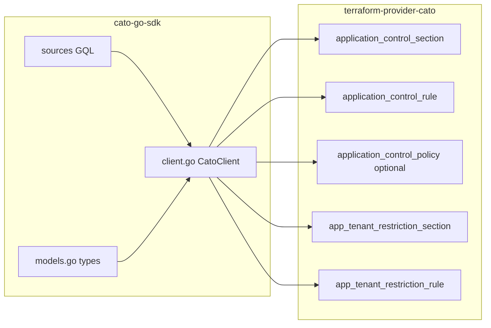

# Terraform plan: Application Control + Tenant Restriction

## What the API actually is (two policies, not one)

CMA tabs map to **two independent GraphQL policy trees** under `PolicyQueries` / `PolicyMutations` in [`cato-go-sdk/cato_api.graphqls`](file:///Users/ilya/work/cato-go-sdk/cato_api.graphqls):

| CMA tab | GraphQL | Policy types |
|--------|---------|----------------|
| Application Control Policy | `policy { applicationControl { policy(...) } }` | [`ApplicationControlPolicy`](file:///Users/ilya/work/cato-go-sdk/cato_api.graphqls) with [`ApplicationControlRule`](file:///Users/ilya/work/cato-go-sdk/cato_api.graphqls): `ruleType` + at most one of `applicationRule`, `dataRule` ([`ApplicationControlDataRule`](file:///Users/ilya/work/cato-go-sdk/cato_api.graphqls)), `fileRule` |
| Tenant Restriction | `policy { appTenantRestriction { policy(...) } }` | [`AppTenantRestrictionPolicy`](file:///Users/ilya/work/cato-go-sdk/cato_api.graphqls) with [`AppTenantRestrictionRule`](file:///Users/ilya/work/cato-go-sdk/cato_api.graphqls) |

Both mutation groups mirror WAN/IF: `addRule`, `updateRule`, `removeRule`, `moveRule`, `addSection` / `moveSection` / `updateSection` / `removeSection`, `createPolicyRevision`, `discardPolicyRevision`, `publishPolicyRevision`, `updatePolicy`. Parent field signatures match other policies, e.g. `applicationControl(input: ApplicationControlPolicyMutationInput)` (optional revision wrapper, same idea as [`wanNetwork(input: ...)`](file:///Users/ilya/work/cato-go-sdk/cato_api.graphqls)).

**SDK today:** [`cato-go-sdk/models/models.go`](file:///Users/ilya/work/cato-go-sdk/models/models.go) already contains the Go structs/enums for both policies and all inputs. **Gap:** there are **no** [`cato-go-sdk/sources/*.gql`](file:///Users/ilya/work/cato-go-sdk/sources) files and **no** symbols in [`cato-go-sdk/client.go`](file:///Users/ilya/work/cato-go-sdk/client.go) for `applicationControl` or `appTenantRestriction` (confirmed by search). The Terraform provider only calls the generated `cato_go_sdk.Client` (e.g. `PolicyWanNetworkAddRule`, `PolicyInternetFirewall*`), so **SDK work is prerequisite**.

Public reference: [ApplicationControlDataRule](https://api.catonetworks.com/documentation/#definition-ApplicationControlDataRule) aligns with the schema block at lines 886–902 in `cato_api.graphqls`.

---

## Recommended Terraform shape (same approach as IF/WAN)

Follow the established split in [`terraform-provider-cato/internal/provider/resource_wan_network_rule.go`](file:///Users/ilya/work/terraform-provider-cato/internal/provider/resource_wan_network_rule.go) and section resources only (**no** `*_rules_index` resource — out of scope per product decision).

### A) Application Control (`applicationControl`)

1. **`cato_application_control_section`** (or shorter stable name after naming review)  
   - Same pattern as [`resource_wan_network_rule.go`](file:///Users/ilya/work/terraform-provider-cato/internal/provider/resource_wan_network_rule.go) section siblings: `at` + `section { id, name }`.  
   - API: `addSection`, `moveSection`, `updateSection`, `removeSection` + publish.

2. **`cato_application_control_rule`**  
   - Top-level: `at` ([`PolicyRulePositionInput`](file:///Users/ilya/work/cato-go-sdk/cato_api.graphqls)) + `rule { ... }` mirroring [`type_wan_network_rule.go`](file:///Users/ilya/work/terraform-provider-cato/internal/provider/type_wan_network_rule.go).  
   - **Cover all API fields + IDs:**  
     - Rule shell: `id`, `index`, `name`, `description`, `enabled`, `section` (from rule), `rule_type` (`APPLICATION` \| `DATA` \| `FILE` per [`ApplicationControlRuleType`](file:///Users/ilya/work/cato-go-sdk/cato_api.graphqls)).  
     - **Exactly one** nested object populated according to `rule_type`:  
       - `application_rule` → full [`ApplicationControlApplicationRule`](file:///Users/ilya/work/cato-go-sdk/cato_api.graphqls) / inputs (accessMethod, action, actionConfig, application, applicationActivity*, applicationContext, applicationCriteria*, device, schedule, severity, source, tracking).  
       - `data_rule` → full [`ApplicationControlDataRule`](file:///Users/ilya/work/cato-go-sdk/cato_api.graphqls) (+ DLP profile, file attributes, applicationContext, etc.).  
       - `file_rule` → full [`ApplicationControlFileRule`](file:///Users/ilya/work/cato-go-sdk/cato_api.graphqls).  
   - CRUD: map to [`ApplicationControlAddRuleInput`](file:///Users/ilya/work/cato-go-sdk/cato_api.graphqls) / [`ApplicationControlUpdateRuleInput`](file:///Users/ilya/work/cato-go-sdk/cato_api.graphqls) / remove + publish, same success/error handling as WAN.

3. **Policy-level toggles** (optional dedicated resource vs. rule-only)  
   - [`ApplicationControlPolicy`](file:///Users/ilya/work/cato-go-sdk/cato_api.graphqls): `enabled`, `additionalAttributes` (`dataControlEnabled` via [`ApplicationControlConfig`](file:///Users/ilya/work/cato-go-sdk/cato_api.graphqls)), `revision` metadata.  
   - [`ApplicationControlPolicyUpdateInput`](file:///Users/ilya/work/cato-go-sdk/cato_api.graphqls) only exposes `additionalAttributes` and `state` — a small **`cato_application_control_policy`** (or attributes block on provider) avoids leaving `dataControlEnabled` untyped.

### B) Tenant Restriction (`appTenantRestriction`)

1. **`cato_app_tenant_restriction_section`** — same section CRUD pattern.  
2. **`cato_app_tenant_restriction_rule`** — `at` + `rule` covering: `id`, `index`, `name`, `description`, `enabled`, `action`, `application` (ref), `headers` (name/value), `schedule`, `severity`, `source` (full [`AppTenantRestrictionSource`](file:///Users/ilya/work/cato-go-sdk/cato_api.graphqls)), plus section info from read.  
3. **Policy-level:** [`AppTenantRestrictionPolicyUpdateInput`](file:///Users/ilya/work/cato-go-sdk/cato_api.graphqls) has `state` only — optional **`cato_app_tenant_restriction_policy`** for account-level enable/disable.

**Hydration:** Add [`type_*.go`](file:///Users/ilya/work/terraform-provider-cato/internal/provider), [`hydrate_*_api.go`](file:///Users/ilya/work/terraform-provider-cato/internal/provider), [`hydrate_*_state.go`](file:///Users/ilya/work/terraform-provider-cato/internal/provider) following WAN/IF; reuse existing helpers for shared subgraphs (`PolicySchedule`, `PolicyTracking`, source lists with `id`/`name` refs) where they already exist for other policies.

**Registration:** [`internal/provider/provider.go`](file:///Users/ilya/work/terraform-provider-cato/internal/provider/provider.go), mocks via `make mocks`, examples under `examples/resources/`, `make docs`.

---

## Pre-implementation API probe (curl)

**Account:** designated **test prod** (no customer traffic); owner confirmed **mutations are allowed** for API characterization before SDK/Terraform work.

**Transport:** `POST` to the account GraphQL endpoint with `x-api-key` and `x-account-id` (same as [`cato-go-sdk/cato.go`](file:///Users/ilya/work/cato-go-sdk/cato.go)).

### Read-only observations

- `policy.applicationControl.policy` returns successfully (`enabled`, `additionalAttributes.dataControlEnabled`, `revision`, `sections`, `rules[]` with `id`, `name`, `index`, `ruleType`, `section`).
- With **no custom sections**, every rule had **empty** `section.id` / `section.name` — treat as implicit default/system section in schema mapping (do not require users to invent a section ID for “built-in” placement).
- `policy.appTenantRestriction.policy` returns successfully; **no rules/sections** in that snapshot (policy `enabled` was false).
- Mix of `APPLICATION`, `DATA`, and `FILE` `ruleType` values under one `applicationControl` policy — confirms a single rule resource with a discriminant remains the right shape.

### Mutation probe (`applicationControl`) — empirical

Sequence: **read summary → `addSection` (`LAST_IN_POLICY`, name `z_tf_probe_section`) → read → `removeSection` (new id) → `publishPolicyRevision` → read.**

| Step | Effect |
|------|--------|
| `addSection` | `SUCCESS`; **new draft revision** appeared on `policy.revision` (was `null` before). |
| Rule membership | **All 28 rules** immediately showed `section.id` / `section.name` = the new section (0 → 28 rules with non-empty section id). **Rule `index` values unchanged** for sampled rules. |
| `removeSection` + `publishPolicyRevision` | Both `SUCCESS`; **revision cleared** to `null`; **section list empty** again; all rules back to **empty** `section.id` / `section.name` (same as pre-probe state). |

**Terraform takeaway:** `addSection` is **not** side-effect-free: it can **attach every existing rule** to the new section and open a **draft revision**. Provider/docs must warn operators; `Read` after section mutations must refresh **every** managed rule’s `section` (or whole policy read). Cleanup for abandoned drafts: `discardPolicyRevision` if publish is not desired (not exercised in this probe).

---

## Cross-resource / “whole policy” mutation risks (Terraform)

- **Section create re-homes rules (confirmed on test account):** `applicationControl.addSection` with `LAST_IN_POLICY` **assigned all existing rules** to the new section while **leaving `index` unchanged**, and created a **draft policy revision**. A Terraform `apply` that only adds a section can therefore **rewrite `section` on every managed rule** in state → large surprise diffs unless `Read` refreshes all rules or users scope Terraform to a dedicated account. Mitigations to design in:
  - Document that section resources are **not isolated** from rule placement.
  - Prefer explicit **`moveRule`** / `at` on rules when changing membership rather than relying on server defaults.
  - Consider **lifecycle** guidance (e.g. ordering: create section → import or update rules with explicit positions) and strong **Read** after mutations to resync `index` / `section`.
- **`updateRule` / defaults:** GraphQL inputs with large defaults can still **overwrite** fields if the API treats omitted nested objects inconsistently — hydrate updates must send stable full structures or use update-specific input types where the API supports partial updates (compare `*UpdateInput` vs full `*Input` per field in [`cato_api.graphqls`](file:///Users/ilya/work/cato-go-sdk/cato_api.graphqls)).
- **Publish / draft:** Mutations may apply to **draft** revision; other actors (UI) can publish — Terraform state can lag until `Read` uses the same revision semantics as other policy resources.

---

## cato-go-sdk implementation sequence

1. Add GraphQL documents under `cato-go-sdk/sources/` for:
   - `query.policy.applicationControl.policy.gql` — read full rule trees needed for drift detection (start from depth used in [`query.policy.wanNetwork.policy.gql`](file:///Users/ilya/work/cato-go-sdk/sources/query.policy.wanNetwork.policy.gql) / IF policy query and expand for `applicationRule` / `dataRule` / `fileRule` branches).  
   - Mutations: `addRule`, `updateRule`, `removeRule`, `moveRule`, section CRUD, `publishPolicyRevision`, `discardPolicyRevision`, `createPolicyRevision`, `updatePolicy` — same naming convention as existing `mutation.policy.wanNetwork.*.gql`.  
   - Parallel set for `appTenantRestriction`.

2. Regenerate [`client.go`](file:///Users/ilya/work/cato-go-sdk/client.go) / `CatoClient` via the repo’s gqlgenc workflow (documented in SDK README/Makefile if any).

3. Tag / pseudo-version bump consumed by [`terraform-provider-cato/go.mod`](file:///Users/ilya/work/terraform-provider-cato/go.mod).

---

## Terraform / API issues to plan for

- **`@beta` on queries and mutations** for both policies in the schema — behavior and fields may change; document as preview/beta in provider docs; some tenants or tokens may lack access (runtime errors).  
- **Discriminated rule content:** API expects `ruleType` to match which of `applicationRule` / `dataRule` / `fileRule` is set. Terraform should enforce with schema validators (`ExactlyOneOf` / custom) and clear diagnostics.  
- **Application matcher exclusivity:** [`ApplicationControlApplication`](file:///Users/ilya/work/cato-go-sdk/cato_api.graphqls) comment: only one of category/application/custom/etc. should be set — same validation burden as other “one-of” app matchers.  
- **Policy revisions / drafts:** Concurrent UI vs. Terraform edits; optional `revision` on read and `ApplicationControlPolicyMutationInput` / `AppTenantRestrictionPolicyMutationInput` on mutations — align with IF’s revision-aware flows where applicable.  
- **Publish semantics:** Like WAN, likely need **publish after mutating** rules (and handle `PolicyMutationStatus` + `errors[]`).  
- **GraphQL default-heavy inputs:** [`ApplicationControlAddRuleDataInput`](file:///Users/ilya/work/cato-go-sdk/cato_api.graphqls) embeds large defaults for unused rule branches — Terraform must send explicit structures to avoid accidental defaults, or rely on API ignoring unused branches (validate with **non-prod** mutations and diff read-back).  
- **Sensitive values:** Tenant restriction `headers` include [`HttpHeaderValue`](file:///Users/ilya/work/cato-go-sdk/cato_api.graphqls) — mark sensitive attributes where appropriate; avoid logging full payloads (align with AppSec rules).  
- **State size / drift:** Deep nested lists (DLP profiles, file attributes, activities) inflate state and increase diff noise; consider `Optional` + computed `name` fields for refs.  
- **Import IDs:** Standard pattern `account_id:rule_id` or single global ID — document explicitly.  
- **Acceptance tests:** Real API policies; coordinate with `DISABLE_POLICY_RULE_CLEANUP` and draft revision behavior already used in [`AGENTS.md`](file:///Users/ilya/work/terraform-provider-cato/AGENTS.md).

---

## Verification (post-implementation)

- Unit tests with mock `CatoClient` interfaces (same mockery pattern as [`internal/provider/mocks/InternetFirewallPolicyClient.go`](file:///Users/ilya/work/terraform-provider-cato/internal/provider/mocks/InternetFirewallPolicyClient.go)).  
- Acc tests or isolated tenant mutations for publish flow and `updateRule` field preservation; prod **read-only** checks optional.

